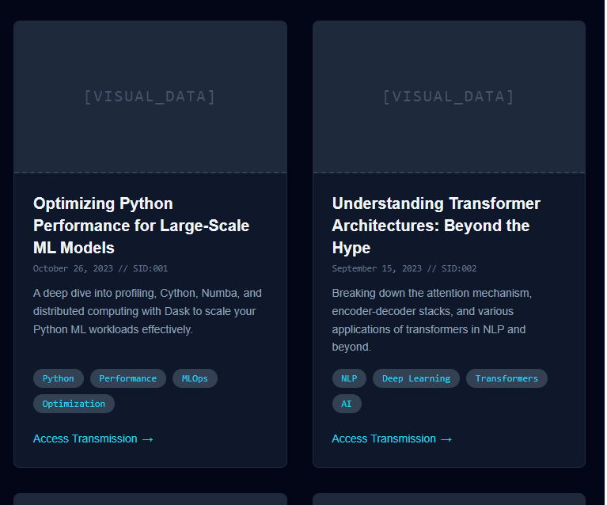

# Blog Design Wireframes

## Overview
This document contains wireframes and design specifications for the blog integration into the portfolio.

## Design Principles
- Clean, readable layout
- Focus on content
- Consistent with portfolio design (tech hub or interface)
- Mobile-first approach
- Blog = DATA::LOGS

## Page Wireframes

### 1. Blog Homepage
Inspo

SVGs

**Components**:
- Hero section with blog title and description (Recent Posts)
- Post cards (title, excerpt, date, category)
- Sidebar with categories and archive (include on all blog pages)
- Pagination

### 2. Blog Post Detail
- Header Img, Details, and blog content.

SVGs

### 3. Category/Tag Pages
Similar to Blog Homepage, just filtered by Category/Tag

### 4. Archive Page
Similar to homepage, just filter by marked archived?

## Mobile Responsive Design

### Mobile Blog Homepage
[Mobile wireframe]

### Mobile Post Detail
[Mobile wireframe]

## Component Specifications

### Post Card Component
- Title (h3)
- Excerpt (150 characters)
- Meta info (date, category, reading time)
- Thumbnail image (optional)
- Read more link

### Navigation Integration
- Blog link in main nav
- Blog-specific sub-navigation
- Breadcrumbs on post pages

---
Last Updated: 5/12/2025
Document Status: In Progress

